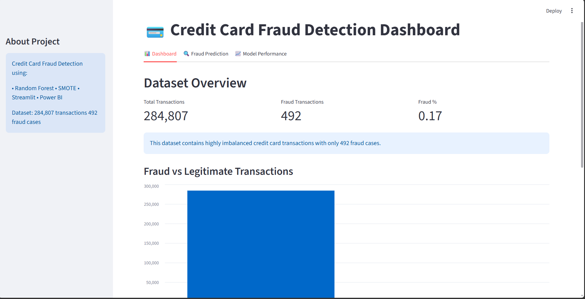
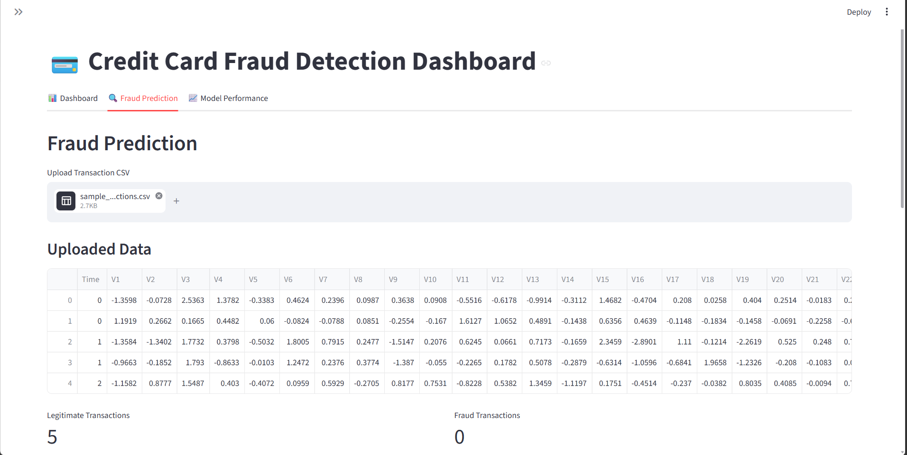
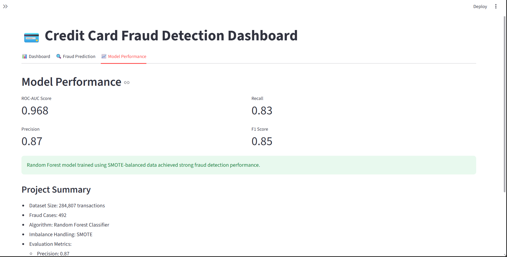

# 💳 Credit Card Fraud Detection System

## 📌 Overview
This project is a Machine Learning-based Credit Card Fraud Detection System built using Python and deployed using Streamlit + GitHub integration.

The system predicts whether a transaction is fraudulent or legitimate using trained ML models. It helps in identifying suspicious transactions and reducing financial fraud risks.

---

## 🚀 Live Deployment
Streamlit App:
https://creditcardfrauddetection-3aqpyvpvp857eg8j7uqwcu.streamlit.app/

---

## 📊 Dataset Information
- Dataset used: Credit Card Fraud Detection Dataset (Kaggle)
- Source: https://www.kaggle.com/datasets/mlg-ulb/creditcardfraud
- Contains:
  - 284,807 transactions
  - 492 fraud cases (highly imbalanced dataset)
  - Features: V1–V28 (anonymized), Time, Amount, Class

NOTE:
The dataset file (creditcard.csv) is not uploaded because of large size. It can be downloaded from Kaggle link above.

---

## 🧠 Machine Learning Models Used
- Logistic Regression
- Decision Tree Classifier
- Random Forest Classifier
- SMOTE (for handling class imbalance)
- XGBoost

---

## 📊 Evaluation Metrics
- Accuracy Score
- Confusion Matrix
- Precision
- Recall
- F1-Score
- ROC-AUC Score

---

## ⚙️ Tech Stack
- Python
- Pandas, NumPy
- Scikit-learn
- Matplotlib, Seaborn
- Streamlit
- Git & GitHub

---

## 🔄 Project Workflow
1. Data Collection (Kaggle Dataset)
2. Data Preprocessing (cleaning, scaling, imbalance handling)
3. Exploratory Data Analysis (EDA)
4. Model Training
5. Model Evaluation
6. Streamlit Web App Development
7. Deployment using GitHub + Streamlit Cloud

---

## 🖥️ How to Run This Project Locally

```bash
git clone https://github.com/your-username/credit_card_fraud_detection.git
cd credit_card_fraud_detection
pip install -r requirements.txt
streamlit run app.py
```

---

## 📸 Screenshots

🏠 Dashboard Page  


🔍 Prediction Page  


📊 Model Results  


---

## 📈 Results
- High performance in detecting legitimate transactions
- Improved recall for fraud detection using SMOTE
- Random Forest performed best among all models
- Performed some advanced model like XGBoost

---

## 👩‍💻 Author
Amrutha Varshini Avvari  
Aspiring Data Scientist 🚀  
GitHub: https://github.com/AmruthavarshiniAvvari

---

## ⭐ If you like this project
Give a star ⭐ to the repository and support the project!
